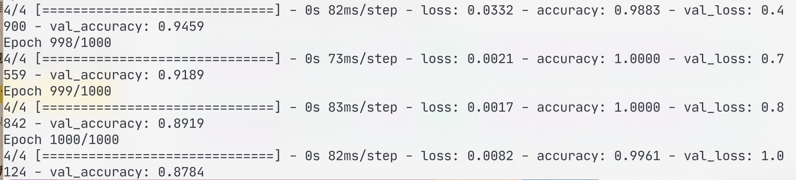

# 基于CNN的性别识别

## 0 环境准备

- `Python 3.8.8`
- 安装python依赖环境：
  ```sh
  python install -r requirements.txt
  ```

- 如果有支持CUDA的NVIDIA显卡
  - 安装`CUDA 10.1`和`cuDNN 7.6.5`，安装教程请百度。


## 1 制作数据集
1. 爬取原始图片
    执行image_spider.py从百度图片爬取人像图片

    ```sh
    python image_spider.py --word "中国女人" --total_page 20 --start_page 1 --per_page 50
    ```

    ```sh
    python image_spider.py --word "中国男人" --total_page 20 --start_page 1 --per_page 50
    ```

    将男性、女性对应的图片文件夹移动到`dataset`文件夹中，并分别重命名为`man`和`woman`。

    > ==注==：爬取的图片越多，识别的泛化能力将越强
    
2. 人脸裁切
   调用OpenCV的`CascadeClassifier`模块，识别爬取的男性、女性人像中的人脸部分，作为男性脸和女性脸的数据集：
   
   ```sh
   python get_face.py
   ```

## 2 训练CNN网络

```sh
python train.py
```

可以在`train.py`中修改训练参数，主要参数是第18行的`epochs`。

目录中已经包含了预训练100轮的文件`gender_detection-100.h5`和1000轮的模型文件`gender_detection-1000.h5`，此时验证集的准确度（accuracy）已经基本能稳定到90%以上：



## 3 推理验证

调用摄像头，检测摄像头中的人脸及性别：

```sh
python detect_gender_webcam.py
```
程序中需要修改第9行的`model`变量决定采用哪个模型文件。